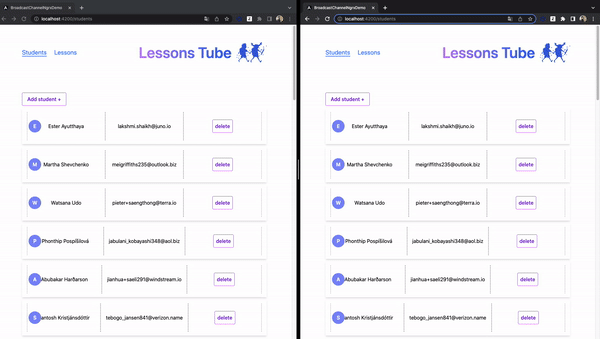

### This is the demo app for the following article: [WIP](https://blog-8avw29wza-stefanoslig.vercel.app/posts/synchronizing-app-state-across-iframes)

#### How to run the project:
1. `npm install`
2. Run the server 
	 `npx json-server --watch db.json --port 3000`   
3. Run the client
	 `npm run start`

Optional step (there are already fake data created):

- Create the fake data
	`npx ts-node generate-fake-data.ts > db.json`
